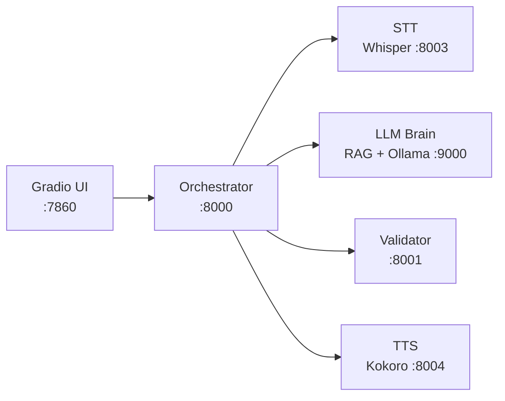

# SHATO — Voice-Controlled Robotic Assistant

Speak a command, SHATO validates it and answers out loud.

Six containerized services turn voice into a schema-checked robot command:
**audio → text → JSON command → validation → spoken reply.**

The LLM is never trusted. Every command it produces must pass the validator service before it
counts as real — hallucinated or malformed commands are rejected, not executed.



## Quick Start

Requires Docker Desktop and ~8 GB free RAM.

```bash
docker compose up --build
```

Open **http://localhost:7860**, record a command, press *Send to Orchestrator*.

First run downloads Whisper `small`, `gemma3:270m`, MiniLM, and Kokoro — expect a few minutes.
Test files are in [`voice_commands/`](voice_commands). Accepted formats: `wav`, `mp3`, `m4a`, `flac`.

## Services

| Service | Port | Stack | Role |
|---|---|---|---|
| `ui-service` | 7860 | Gradio | Record audio, show results, play reply |
| `orchestrator` | 8000 | FastAPI | Calls every service in order, merges results |
| `stt-service` | 8003 | Whisper `small` | Speech → text |
| `llm-service` | 9000 | ChromaDB + Ollama `gemma3:270m` | Text → JSON command |
| `robot-validator` | 8001 | FastAPI + Pydantic | Schema gate; simulates the robot |
| `tts-service` | 8004 | Kokoro | Reply → speech |

## Command Schema

```json
{ "command": "<command_name>", "command_params": { } }
```

| Command | Parameters |
|---|---|
| `move_to` | `x` float **required** · `y` float **required** |
| `rotate` | `angle` float **required** · `direction` **required**, `clockwise` or `counter-clockwise` |
| `start_patrol` | `route_id` **required**, one of `first_floor` / `bedrooms` / `second_floor` · `speed` optional (`slow`/`medium`/`fast`, default `medium`) · `repeat_count` optional int, default `1` (`-1` = continuous) |

Anything else — unknown command, missing field, value outside the allowed set — returns HTTP 400.

## API

| Endpoint | Description |
|---|---|
| `POST :8000/process_audio/` | Full pipeline — audio in, transcription + command + validation + audio reply out |
| `GET :8000/tts/{text}` | Direct text-to-speech, returns `.wav` |
| `POST :8003/transcribe` | Audio → `{ "text": ... }` |
| `POST :9000/chat` | `{ "message": "..." }` → parsed command JSON |
| `POST :8001/execute_command` | Validate a command — 200 valid, 400 invalid |
| `POST :8004/speak` | `{ "text": ..., "voice": ... }` → `.wav` |

All services expose `GET /health`; the orchestrator's reports every dependency at once.

```bash
curl -X POST "http://localhost:8000/process_audio/" -F "file=@voice_commands/rotate_90_left.m4a"
```

## How the LLM Brain Works

1. **Retrieve** — the sentence is embedded with `all-MiniLM-L6-v2`; the 4 nearest examples come
   from a ChromaDB index built at startup from [`llm-service/app/data/`](llm-service/app/data)
   (1,251 examples: 498 `move_to`, 395 `rotate`, 236 `start_patrol`, 122 chat).
2. **Generate** — examples plus a strict system prompt go to `gemma3:270m` on local Ollama.
3. **Parse** — a 270M model rarely returns clean JSON, so `parse_llm_response()` falls back
   through five strategies: markdown fences → brace matching → regex → keyword/coordinates → text.
4. **Validate** — the result goes to the validator. Only then is it a real command.

[`data_expansion/`](llm-service/app/data_expansion) holds the scripts that built that corpus.

## Layout

```
Project-Shato/
├── docker-compose.yml       # All six services, one network
├── orchestrator/            # Pipeline coordinator
├── stt-service/             # Whisper transcription
├── llm-service/app/
│   ├── api_rag.py           # RAG + Ollama + JSON parser
│   ├── data/                # Corpus indexed at startup
│   └── data_expansion/      # Dataset scripts
├── robot-validator-api/     # main.py + validator.py (schema)
├── tts-service/             # Kokoro synthesis
├── ui-service/              # Gradio interface
└── voice_commands/          # Sample recordings
```

## Configuration

Set in `docker-compose.yml`: `ORCHESTRATOR_URL`, `LLM_URL`, `VALIDATOR_URL`, `TTS_URL`, `OLLAMA_URL`.

## Troubleshooting

| Symptom | Fix |
|---|---|
| `start.sh: bad interpreter` | Rebuild with `--no-cache` (Dockerfile runs `dos2unix`) |
| LLM `unreachable` in `/health` | Ollama still pulling the model — `docker logs llm-service` |
| First request times out | Models load lazily; retry after startup logs settle |
| Out of memory on build | Build one at a time: `docker compose build llm-service` |

## Known Limitations

- The LLM prompt describes `rotate` without `direction` and `start_patrol` with null params,
  while the validator requires both. RAG examples usually fill the gap; when they don't, the
  validator rejects the command — intended behaviour, not a failure.
- `repeat_count` isn't range-checked against the `>= 1 or -1` rule.
- The validator simulates the robot: it verifies and logs, it doesn't drive hardware.

